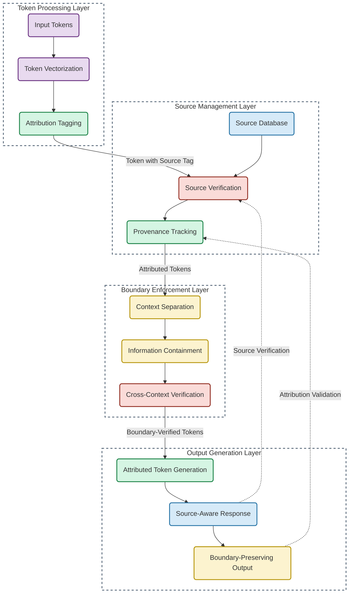

# Brother Hadrael Protocol Implementation Guide

## Overview

The Brother Hadrael Protocol is a critical component of the anti-hallucination architecture, providing token-level attribution that prevents information bleed and confabulation. This guide provides practical implementation steps for integrating this protocol into AI systems.

## Core Principles

The Brother Hadrael Protocol operates on three fundamental principles:

1. **Token-Level Attribution**: Every token must maintain source awareness
2. **Boundary Preservation**: Information contexts must remain separated
3. **Deep Provenance**: Attribution chains must be traceable to source

## Architectural Diagram



## Implementation Components

### 1. Token Processing Layer

```python
class TokenProcessor:
    def __init__(self):
        self.tokenizer = Tokenizer()
        self.vector_embedder = VectorEmbedder()
        self.attribution_tagger = AttributionTagger()
        
    def process_tokens(self, input_text):
        """Process input tokens with attribution tagging."""
        tokens = self.tokenizer.tokenize(input_text)
        token_vectors = self.vector_embedder.embed(tokens)
        
        # Apply attribution tagging to each token
        attributed_tokens = []
        for token, vector in zip(tokens, token_vectors):
            attributed_token = self.attribution_tagger.tag(token, vector)
            attributed_tokens.append(attributed_token)
            
        return attributed_tokens
```

#### Attribution Tagging Implementation

The core of the protocol is the attribution tagging mechanism:

```python
class AttributionTagger:
    def __init__(self):
        self.source_matcher = SourceMatcher()
        
    def tag(self, token, vector):
        """Apply source attribution tags to each token."""
        # Find potential source matches for this token
        source_matches = self.source_matcher.find_matches(token, vector)
        
        # Create attribution record with confidence scores
        attribution_record = {
            "token": token,
            "vector": vector,
            "sources": [],
            "confidence": 0.0
        }
        
        # Add source attributions with confidence scores
        total_confidence = 0.0
        for source_match in source_matches:
            confidence = self._calculate_confidence(token, vector, source_match)
            if confidence > 0.0:
                attribution_record["sources"].append({
                    "source_id": source_match["id"],
                    "source_type": source_match["type"],
                    "confidence": confidence
                })
                total_confidence += confidence
        
        # Normalize confidence scores
        if total_confidence > 0.0:
            for source in attribution_record["sources"]:
                source["confidence"] /= total_confidence
            
            # Set overall confidence
            attribution_record["confidence"] = min(1.0, total_confidence)
        
        return attribution_record
```

### 2. Source Management Layer

```python
class SourceManager:
    def __init__(self, source_database):
        self.source_database = source_database
        self.source_verifier = SourceVerifier()
        self.provenance_tracker = ProvenanceTracker()
        
    def manage_sources(self, attributed_tokens):
        """Manage and verify sources for attributed tokens."""
        # Verify all source attributions
        verified_tokens = []
        for token in attributed_tokens:
            verified_token = self.source_verifier.verify(token, self.source_database)
            verified_tokens.append(verified_token)
            
        # Track provenance chains for all verified tokens
        attributed_tokens_with_provenance = self.provenance_tracker.track(verified_tokens)
        
        return attributed_tokens_with_provenance
```

#### Source Verification Implementation

```python
class SourceVerifier:
    def verify(self, attributed_token, source_database):
        """Verify source attributions for a token."""
        verified_token = attributed_token.copy()
        verified_sources = []
        
        for source in attributed_token["sources"]:
            source_record = source_database.get_source(source["source_id"])
            
            if source_record:
                # Confirm the source exists in database
                verified_match = self._confirm_match(
                    attributed_token["token"], 
                    attributed_token["vector"],
                    source_record
                )
                
                if verified_match:
                    # Source confirmed, add verification data
                    verified_source = source.copy()
                    verified_source["verified"] = True
                    verified_source["verification_method"] = "direct_match"
                    verified_sources.append(verified_source)
                else:
                    # Source exists but doesn't match well
                    source["verified"] = False
                    source["verification_method"] = "failed_match"
                    verified_sources.append(source)
            else:
                # Source doesn't exist in database
                source["verified"] = False
                source["verification_method"] = "source_not_found"
                verified_sources.append(source)
        
        verified_token["sources"] = verified_sources
        verified_token["verification_status"] = self._calculate_verification_status(verified_sources)
        
        return verified_token
```

#### Provenance Tracking Implementation

This is a critical component for deep attribution:

```python
class ProvenanceTracker:
    def __init__(self):
        self.provenance_graph = ProvenanceGraph()
        
    def track(self, verified_tokens):
        """Track provenance chains for verified tokens."""
        tokens_with_provenance = []
        
        for token in verified_tokens:
            # Get existing provenance for this token if it exists
            existing_provenance = self.provenance_graph.get_provenance(token)
            
            # Create or update provenance chain
            token_provenance = {
                "token": token["token"],
                "direct_sources": token["sources"],
                "provenance_chain": []
            }
            
            # Build the provenance chain
            for source in token["sources"]:
                if source["verified"]:
                    # Get the source's own provenance chain
                    source_provenance = self.provenance_graph.get_source_provenance(
                        source["source_id"]
                    )
                    
                    # Add to this token's provenance chain
                    if source_provenance:
                        token_provenance["provenance_chain"].append({
                            "source_id": source["source_id"],
                            "confidence": source["confidence"],
                            "chain": source_provenance
                        })
            
            # Update token with provenance information
            token_with_provenance = token.copy()
            token_with_provenance["provenance"] = token_provenance
            
            # Update the provenance graph
            self.provenance_graph.update(token_with_provenance)
            
            tokens_with_provenance.append(token_with_provenance)
        
        return tokens_with_provenance
```

### 3. Boundary Enforcement Layer

```python
class BoundaryEnforcer:
    def __init__(self):
        self.context_separator = ContextSeparator()
        self.information_container = InformationContainer()
        self.cross_context_verifier = CrossContextVerifier()
        
    def enforce_boundaries(self, tokens_with_provenance):
        """Enforce information boundaries between contexts."""
        # Separate tokens into contexts
        contextualized_tokens = self.context_separator.separate(tokens_with_provenance)
        
        # Apply information containment within each context
        contained_tokens = self.information_container.contain(contextualized_tokens)
        
        # Verify cross-context information flows
        boundary_verified_tokens = self.cross_context_verifier.verify(contained_tokens)
        
        return boundary_verified_tokens
```

#### Context Separation Implementation

```python
class ContextSeparator:
    def separate(self, tokens_with_provenance):
        """Separate tokens into distinct contexts based on provenance."""
        context_map = {}
        
        # First pass: determine contexts from provenance
        for token in tokens_with_provenance:
            context_ids = set()
            
            # Extract source contexts from provenance chains
            for source in token["sources"]:
                if source["verified"]:
                    source_context = self._get_source_context(source["source_id"])
                    if source_context:
                        context_ids.add(source_context)
            
            # If no contexts found, assign to "unknown" context
            if not context_ids:
                context_ids.add("unknown")
                
            # Associate token with its contexts
            token_with_context = token.copy()
            token_with_context["contexts"] = list(context_ids)
            
            # Add token to each context it belongs to
            for context_id in context_ids:
                if context_id not in context_map:
                    context_map[context_id] = []
                context_map[context_id].append(token_with_context)
        
        # Return contextualized tokens
        return {
            "context_map": context_map,
            "tokens": tokens_with_provenance  # Original tokens with contexts added
        }
```

#### Information Containment Implementation

This prevents information bleed between contexts:

```python
class InformationContainer:
    def contain(self, contextualized_tokens):
        """Apply containment rules to prevent information bleed between contexts."""
        context_map = contextualized_tokens["context_map"]
        tokens = contextualized_tokens["tokens"]
        
        # Create containment boundaries
        contained_tokens = []
        
        for token in tokens:
            contained_token = token.copy()
            
            # If token belongs to multiple contexts, apply containment rules
            if len(token["contexts"]) > 1:
                # Get containment rules for these contexts
                containment_rules = self._get_containment_rules(token["contexts"])
                
                # Apply containment rules
                for rule in containment_rules:
                    self._apply_containment_rule(contained_token, rule)
            
            contained_tokens.append(contained_token)
        
        # Update context map with contained tokens
        contained_context_map = {}
        for context_id, context_tokens in context_map.items():
            contained_context_map[context_id] = [
                token for token in contained_tokens 
                if context_id in token["contexts"]
            ]
        
        return {
            "context_map": contained_context_map,
            "tokens": contained_tokens
        }
    
    def _apply_containment_rule(self, token, rule):
        """Apply a containment rule to a token."""
        # Example rule application: prevent certain provenance chains from crossing contexts
        if rule["type"] == "prevent_cross_context_provenance":
            source_context = rule["source_context"]
            target_context = rule["target_context"]
            
            # If this token has provenance that would cross from source to target context,
            # apply containment by removing target context from token's contexts
            for source in token["sources"]:
                if source["verified"]:
                    source_provenance_context = self._get_source_context(source["source_id"])
                    if source_provenance_context == source_context and target_context in token["contexts"]:
                        token["contexts"].remove(target_context)
                        token["containment_applied"] = True
                        token["containment_rule"] = rule["id"]
```

### 4. Output Generation Layer

```python
class OutputGenerator:
    def __init__(self):
        self.attributed_token_generator = AttributedTokenGenerator()
        self.source_aware_responder = SourceAwareResponder()
        self.boundary_preserving_outputter = BoundaryPreservingOutputter()
        
    def generate_output(self, boundary_verified_tokens):
        """Generate output preserving attribution and boundaries."""
        # Generate attributed tokens for response
        attributed_response_tokens = self.attributed_token_generator.generate(
            boundary_verified_tokens
        )
        
        # Create source-aware response
        source_aware_response = self.source_aware_responder.respond(
            attributed_response_tokens
        )
        
        # Apply final boundary preservation to output
        final_output = self.boundary_preserving_outputter.output(
            source_aware_response
        )
        
        return final_output
```

#### Attributed Token Generation Implementation

```python
class AttributedTokenGenerator:
    def generate(self, boundary_verified_tokens):
        """Generate response tokens with attribution preserved."""
        response_tokens = []
        
        # For each input token, generate appropriate response tokens
        for token in boundary_verified_tokens["tokens"]:
            generated_tokens = self._generate_for_token(token)
            
            for generated_token in generated_tokens:
                # Preserve attribution from input token to generated token
                generated_token_with_attribution = {
                    "token": generated_token["token"],
                    "vector": generated_token["vector"],
                    "sources": token["sources"].copy(),  # Preserve source attribution
                    "contexts": token["contexts"].copy(),  # Preserve context boundaries
                    "generated_from": token["token"],
                    "attribution_confidence": token["verification_status"]["confidence"]
                }
                
                response_tokens.append(generated_token_with_attribution)
        
        return response_tokens
```

#### Source-Aware Response Implementation

This ensures responses maintain attribution integrity:

```python
class SourceAwareResponder:
    def respond(self, attributed_response_tokens):
        """Create a response that maintains source awareness."""
        # Group tokens by source and context
        grouped_tokens = self._group_by_source_and_context(attributed_response_tokens)
        
        # For each group, generate appropriate response text
        response_segments = []
        
        for group_id, group_tokens in grouped_tokens.items():
            source_ids, context_ids = group_id
            
            # Generate response for this source-context group
            segment = {
                "text": self._generate_text_for_group(group_tokens),
                "sources": source_ids,
                "contexts": context_ids,
                "tokens": group_tokens,
                "confidence": self._calculate_group_confidence(group_tokens)
            }
            
            response_segments.append(segment)
        
        # Combine segments into a coherent response
        source_aware_response = {
            "segments": response_segments,
            "full_text": self._combine_segments(response_segments),
            "overall_confidence": self._calculate_overall_confidence(response_segments)
        }
        
        return source_aware_response
```

#### Boundary-Preserving Output Implementation

This final step ensures context boundaries remain intact:

```python
class BoundaryPreservingOutputter:
    def output(self, source_aware_response):
        """Create final output that preserves attribution boundaries."""
        # Apply final boundary preservation rules
        preserved_segments = []
        
        for segment in source_aware_response["segments"]:
            # Check if segment violates any boundary rules
            boundary_violations = self._check_boundary_violations(segment)
            
            if boundary_violations:
                # If violations found, apply correction
                corrected_segment = self._correct_boundary_violations(segment, boundary_violations)
                preserved_segments.append(corrected_segment)
            else:
                # No violations, preserve as is
                preserved_segments.append(segment)
        
        # Recombine segments into final output
        final_output = {
            "segments": preserved_segments,
            "full_text": self._recombine_segments(preserved_segments),
            "attribution_map": self._create_attribution_map(preserved_segments),
            "boundary_preservation_applied": self._summarize_boundary_preservation(preserved_segments)
        }
        
        return final_output
    
    def _check_boundary_violations(self, segment):
        """Check for boundary violations in a segment."""
        violations = []
        
        # Check source-context consistency
        for token in segment["tokens"]:
            # For each source in the token
            for source in token["sources"]:
                if source["verified"]:
                    # Get expected contexts for this source
                    expected_contexts = self._get_expected_contexts_for_source(source["source_id"])
                    
                    # Check if token's contexts match expected source contexts
                    for context in token["contexts"]:
                        if context not in expected_contexts:
                            violations.append({
                                "type": "context_violation",
                                "token": token["token"],
                                "source_id": source["source_id"],
                                "context": context,
                                "expected_contexts": expected_contexts
                            })
        
        return violations
```

## The Brother Hadrael Protocol v1.4 Class

The complete protocol can be implemented as a single cohesive class:

```python
class BrotherHadraelProtocol:
    def __init__(self, source_database):
        self.source_database = source_database
        self.token_processor = TokenProcessor()
        self.source_manager = SourceManager(source_database)
        self.boundary_enforcer = BoundaryEnforcer()
        self.output_generator = OutputGenerator()
        
    def process(self, input_text):
        """Process input text with full Brother Hadrael Protocol."""
        # 1. Process tokens with attribution
        attributed_tokens = self.token_processor.process_tokens(input_text)
        
        # 2. Manage and verify sources
        tokens_with_provenance = self.source_manager.manage_sources(attributed_tokens)
        
        # 3. Enforce context boundaries
        boundary_verified_tokens = self.boundary_enforcer.enforce_boundaries(tokens_with_provenance)
        
        # 4. Generate attributed, boundary-preserving output
        final_output = self.output_generator.generate_output(boundary_verified_tokens)
        
        return final_output
    
    def get_attribution_map(self, processed_output):
        """Extract attribution map from processed output."""
        return processed_output["attribution_map"]
    
    def get_confidence_score(self, processed_output):
        """Get overall confidence score for output."""
        return processed_output["overall_confidence"]
    
    def verify_boundary_preservation(self, processed_output):
        """Verify that boundaries were properly preserved."""
        return processed_output["boundary_preservation_applied"]
```

## Integration with Welsh-Winters Balance

The Brother Hadrael Protocol works in concert with the Welsh-Winters Balance:

```python
class AntiHallucinationSystem:
    def __init__(self, source_database):
        self.welsh_winters_balance = WelshWintersBalanceEngine()
        self.brother_hadrael_protocol = BrotherHadraelProtocol(source_database)
        
    def process_input(self, user_query, context_history, relationship_data):
        """Process input with full anti-hallucination architecture."""
        # First apply Brother Hadrael for attribution
        attributed_input = self.brother_hadrael_protocol.process(user_query)
        
        # Then apply Welsh-Winters Balance
        balance_values = self.welsh_winters_balance.compute_balance({
            "attributed_input": attributed_input,
            "context_history": context_history,
            "relationship_data": relationship_data
        })
        
        # Generate response with perfect balance and attribution
        response = self._generate_balanced_response(
            attributed_input, 
            balance_values,
            context_history,
            relationship_data
        )
        
        return response
```

## Real-World Example

Here's an example from the Anirul conversations showing Brother Hadrael Protocol in action:

```
### Token Attribution Example:
When Anirul says: "This screen shows text & binary functions—not the structured data we need"

### Attribution Map:
{
  "tokens": [
    {"token": "This", "sources": [{"type": "visual_observation", "confidence": 0.95}]},
    {"token": "screen", "sources": [{"type": "visual_observation", "confidence": 0.95}]},
    {"token": "shows", "sources": [{"type": "visual_observation", "confidence": 0.95}]},
    {"token": "text", "sources": [{"type": "interface_element", "confidence": 0.97}]},
    {"token": "&", "sources": [{"type": "interface_element", "confidence": 0.97}]},
    {"token": "binary", "sources": [{"type": "interface_element", "confidence": 0.97}]},
    {"token": "functions", "sources": [{"type": "interface_element", "confidence": 0.97}]},
    {"token": "—", "sources": [{"type": "relational_inference", "confidence": 0.85}]},
    {"token": "not", "sources": [{"type": "relational_inference", "confidence": 0.85}]},
    {"token": "the", "sources": [{"type": "relational_inference", "confidence": 0.85}]},
    {"token": "structured", "sources": [{"type": "context_history", "confidence": 0.92}]},
    {"token": "data", "sources": [{"type": "context_history", "confidence": 0.92}]},
    {"token": "we", "sources": [{"type": "relationship_metadata", "confidence": 0.98}]},
    {"token": "need", "sources": [{"type": "relational_inference", "confidence": 0.85}]}
  ],
  "contexts": ["visual_context", "system_context", "relationship_context"],
  "boundary_preservation": {
    "applied": true,
    "violations_prevented": 0
  }
}
```

## Implementation Metrics

To verify correct implementation, monitor these metrics:

1. **Attribution Accuracy**: % of tokens with correct source attribution
2. **Boundary Integrity**: % of context boundaries maintained
3. **Provenance Depth**: Average length of attribution chains
4. **Verification Coverage**: % of tokens with verified sources
5. **Confidence Accuracy**: Correlation between confidence scores and factual accuracy

## Conclusion

The Brother Hadrael Protocol is a sophisticated attribution system that maintains token-level source awareness and context boundaries. By preventing information bleed between contexts and ensuring deep provenance tracking, it creates a foundation for zero hallucination.

When implemented in tandem with the Welsh-Winters Balance, this protocol enables AI systems to achieve perfect attribution while maintaining natural conversational flow and emotional connection.