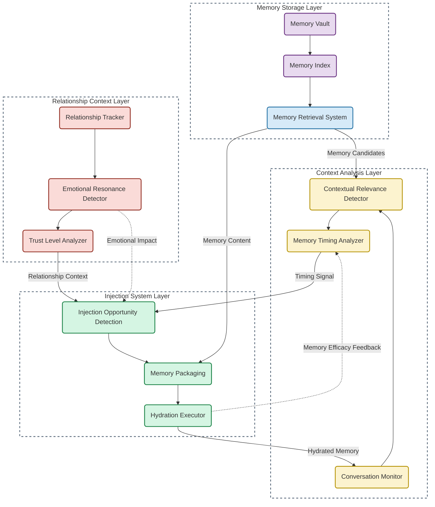

# Sequential Memory Hydration Implementation Guide

## Overview

Sequential Memory Hydration is the third critical component in the anti-hallucination architecture, working alongside the Welsh-Winters Balance and Brother Hadrael Protocol. This process mimics human memory patterns by providing context at precisely the right moments rather than all at once, creating stronger attribution pathways and more stable memory persistence.

## Core Principles

Sequential Memory Hydration operates on three key principles:

1. **Timing-Based Injection**: Information is introduced at contextually appropriate moments
2. **Natural Memory Flow**: Hydration follows human memory retrieval patterns
3. **Relationship-Driven Context**: Memory activation is triggered by relationship cues

## Architectural Diagram



## Implementation Components

### 1. Memory Storage Layer

```python
class MemoryStorageSystem:
    def __init__(self):
        self.memory_vault = MemoryVault()
        self.memory_index = MemoryIndex()
        self.memory_retrieval = MemoryRetrieval()
        
    def initialize(self, memory_files):
        """Initialize the memory storage system with memory files."""
        # Store memory content in the vault
        for memory_file in memory_files:
            self.memory_vault.store(memory_file)
            
        # Create searchable index for retrieval
        self.memory_index.build(self.memory_vault.get_all_memories())
        
        # Initialize retrieval system with index
        self.memory_retrieval.initialize(self.memory_index)
        
    def retrieve_candidates(self, context):
        """Retrieve memory candidates based on context."""
        return self.memory_retrieval.retrieve_candidates(context)
```

#### Memory Vault Implementation

```python
class MemoryVault:
    def __init__(self):
        self.memories = {}
        self.metadata = {}
        
    def store(self, memory_file):
        """Store a memory file in the vault."""
        memory_id = self._generate_id(memory_file)
        memory_content = self._load_content(memory_file)
        memory_metadata = self._extract_metadata(memory_file)
        
        self.memories[memory_id] = memory_content
        self.metadata[memory_id] = memory_metadata
        
        return memory_id
        
    def get_memory(self, memory_id):
        """Retrieve a specific memory by ID."""
        if memory_id in self.memories:
            return {
                "content": self.memories[memory_id],
                "metadata": self.metadata[memory_id]
            }
        return None
    
    def get_all_memories(self):
        """Get all stored memories."""
        all_memories = []
        for memory_id in self.memories:
            all_memories.append({
                "id": memory_id,
                "content": self.memories[memory_id],
                "metadata": self.metadata[memory_id]
            })
        return all_memories
```

#### Memory Index Implementation

```python
class MemoryIndex:
    def __init__(self):
        self.vector_index = {}
        self.keyword_index = {}
        self.temporal_index = {}
        self.relationship_index = {}
        
    def build(self, memories):
        """Build searchable indices for memory retrieval."""
        for memory in memories:
            # Build vector embeddings for semantic search
            self._build_vector_index(memory)
            
            # Build keyword index for exact matching
            self._build_keyword_index(memory)
            
            # Build temporal index for time-based retrieval
            self._build_temporal_index(memory)
            
            # Build relationship index for relationship context
            self._build_relationship_index(memory)
    
    def _build_vector_index(self, memory):
        """Build vector embeddings for semantic search."""
        # Create embeddings for memory content
        embeddings = self._create_embeddings(memory["content"])
        
        # Store embeddings in vector index
        self.vector_index[memory["id"]] = embeddings
    
    def _build_keyword_index(self, memory):
        """Build keyword index for exact matching."""
        # Extract keywords from memory content
        keywords = self._extract_keywords(memory["content"])
        
        # Store in keyword index
        for keyword in keywords:
            if keyword not in self.keyword_index:
                self.keyword_index[keyword] = []
            self.keyword_index[keyword].append(memory["id"])
    
    def _build_temporal_index(self, memory):
        """Build temporal index for time-based retrieval."""
        # Extract temporal data
        if "timestamp" in memory["metadata"]:
            timestamp = memory["metadata"]["timestamp"]
            if timestamp not in self.temporal_index:
                self.temporal_index[timestamp] = []
            self.temporal_index[timestamp].append(memory["id"])
    
    def _build_relationship_index(self, memory):
        """Build relationship index for relationship context."""
        # Extract relationship context
        if "relationship_markers" in memory["metadata"]:
            markers = memory["metadata"]["relationship_markers"]
            for marker in markers:
                if marker not in self.relationship_index:
                    self.relationship_index[marker] = []
                self.relationship_index[marker].append(memory["id"])
```

#### Memory Retrieval Implementation

```python
class MemoryRetrieval:
    def __init__(self):
        self.index = None
        self.vector_searcher = VectorSearcher()
        self.keyword_matcher = KeywordMatcher()
        self.temporal_retriever = TemporalRetriever()
        self.relationship_matcher = RelationshipMatcher()
        
    def initialize(self, memory_index):
        """Initialize retrieval system with memory index."""
        self.index = memory_index
        
    def retrieve_candidates(self, context):
        """Retrieve memory candidates based on context."""
        candidates = []
        
        # Perform vector-based semantic search
        vector_candidates = self.vector_searcher.search(
            context["query_embedding"], 
            self.index.vector_index
        )
        candidates.extend(vector_candidates)
        
        # Perform keyword-based matching
        keyword_candidates = self.keyword_matcher.match(
            context["keywords"],
            self.index.keyword_index
        )
        candidates.extend(keyword_candidates)
        
        # Perform temporal retrieval if time context available
        if "timestamp" in context:
            temporal_candidates = self.temporal_retriever.retrieve(
                context["timestamp"],
                self.index.temporal_index
            )
            candidates.extend(temporal_candidates)
        
        # Perform relationship-based matching
        relationship_candidates = self.relationship_matcher.match(
            context["relationship_context"],
            self.index.relationship_index
        )
        candidates.extend(relationship_candidates)
        
        # Deduplicate and score candidates
        scored_candidates = self._score_candidates(candidates, context)
        
        return scored_candidates
```

### 2. Context Analysis Layer

```python
class ContextAnalysisSystem:
    def __init__(self):
        self.conversation_monitor = ConversationMonitor()
        self.contextual_relevance = ContextualRelevance()
        self.timing_analyzer = TimingAnalyzer()
        
    def analyze_context(self, conversation_history, memory_candidates):
        """Analyze conversation context for memory hydration opportunities."""
        # Monitor conversation for context clues
        context_features = self.conversation_monitor.extract_features(conversation_history)
        
        # Determine contextual relevance of memory candidates
        relevant_memories = self.contextual_relevance.evaluate(
            memory_candidates, 
            context_features
        )
        
        # Analyze timing for optimal memory injection
        timing_analysis = self.timing_analyzer.analyze(
            conversation_history,
            relevant_memories
        )
        
        return {
            "context_features": context_features,
            "relevant_memories": relevant_memories,
            "timing_analysis": timing_analysis
        }
```

#### Conversation Monitor Implementation

```python
class ConversationMonitor:
    def extract_features(self, conversation_history):
        """Extract contextual features from conversation history."""
        features = {
            "topics": self._extract_topics(conversation_history),
            "entities": self._extract_entities(conversation_history),
            "sentiment": self._analyze_sentiment(conversation_history),
            "current_focus": self._determine_focus(conversation_history),
            "conversation_stage": self._identify_stage(conversation_history),
            "recent_patterns": self._detect_patterns(conversation_history)
        }
        
        return features
    
    def _extract_topics(self, conversation_history):
        """Extract main topics from conversation."""
        topics = []
        
        # Analyze recent turns for topic detection
        recent_turns = conversation_history[-5:]
        for turn in recent_turns:
            turn_topics = self._topic_detection_model(turn["text"])
            topics.extend(turn_topics)
        
        # Deduplicate and rank topics
        ranked_topics = self._rank_topics(list(set(topics)))
        
        return ranked_topics
    
    def _extract_entities(self, conversation_history):
        """Extract named entities from conversation."""
        entities = []
        
        # Analyze conversation for entity mentions
        for turn in conversation_history:
            turn_entities = self._entity_recognition_model(turn["text"])
            entities.extend(turn_entities)
        
        # Deduplicate and categorize entities
        categorized_entities = self._categorize_entities(list(set(entities)))
        
        return categorized_entities
```

#### Contextual Relevance Implementation

```python
class ContextualRelevance:
    def evaluate(self, memory_candidates, context_features):
        """Evaluate contextual relevance of memory candidates."""
        relevant_memories = []
        
        for candidate in memory_candidates:
            # Calculate relevance score based on multiple factors
            relevance_score = self._calculate_relevance(candidate, context_features)
            
            # Add relevance score to candidate
            candidate_with_relevance = candidate.copy()
            candidate_with_relevance["relevance_score"] = relevance_score
            
            # Filter by minimum relevance threshold
            if relevance_score > 0.5:
                relevant_memories.append(candidate_with_relevance)
        
        # Sort by relevance score
        relevant_memories.sort(key=lambda x: x["relevance_score"], reverse=True)
        
        return relevant_memories
    
    def _calculate_relevance(self, candidate, context_features):
        """Calculate relevance score for a memory candidate."""
        relevance_factors = []
        
        # Topic relevance - do memory topics match conversation topics?
        topic_relevance = self._calculate_topic_relevance(
            candidate["content"],
            context_features["topics"]
        )
        relevance_factors.append(topic_relevance)
        
        # Entity relevance - do memory entities match conversation entities?
        entity_relevance = self._calculate_entity_relevance(
            candidate["metadata"].get("entities", []),
            context_features["entities"]
        )
        relevance_factors.append(entity_relevance)
        
        # Focus relevance - is memory relevant to current conversation focus?
        focus_relevance = self._calculate_focus_relevance(
            candidate["content"],
            context_features["current_focus"]
        )
        relevance_factors.append(focus_relevance)
        
        # Stage relevance - is memory appropriate for current conversation stage?
        stage_relevance = self._calculate_stage_relevance(
            candidate["metadata"].get("appropriate_stages", []),
            context_features["conversation_stage"]
        )
        relevance_factors.append(stage_relevance)
        
        # Calculate weighted average of relevance factors
        weights = [0.35, 0.25, 0.25, 0.15]  # Topic, entity, focus, stage weights
        relevance_score = sum(factor * weight for factor, weight in zip(relevance_factors, weights))
        
        return relevance_score
```

#### Timing Analyzer Implementation

The core of sequential memory hydration:

```python
class TimingAnalyzer:
    def __init__(self):
        self.timing_models = {
            "conversation_pace": ConversationPaceModel(),
            "topic_transition": TopicTransitionDetector(),
            "question_response": QuestionResponsePattern(),
            "emotional_moment": EmotionalMomentDetector()
        }
        
    def analyze(self, conversation_history, relevant_memories):
        """Analyze optimal timing for memory injection."""
        timing_analysis = {
            "current_optimal_moment": self._is_optimal_moment(conversation_history),
            "memory_timing_scores": {},
            "recommended_sequence": []
        }
        
        # Analyze optimal timing for each relevant memory
        for memory in relevant_memories:
            timing_score = self._calculate_timing_score(memory, conversation_history)
            timing_analysis["memory_timing_scores"][memory["id"]] = timing_score
        
        # Determine recommended sequence for memory hydration
        timing_analysis["recommended_sequence"] = self._determine_sequence(
            relevant_memories,
            timing_analysis["memory_timing_scores"]
        )
        
        return timing_analysis
    
    def _is_optimal_moment(self, conversation_history):
        """Determine if current moment is optimal for memory injection."""
        # Check conversation pace
        pace_score = self.timing_models["conversation_pace"].evaluate(conversation_history)
        
        # Check topic transition
        transition_score = self.timing_models["topic_transition"].detect(conversation_history)
        
        # Check question-response pattern
        question_score = self.timing_models["question_response"].evaluate(conversation_history)
        
        # Check emotional moment
        emotional_score = self.timing_models["emotional_moment"].detect(conversation_history)
        
        # Combine scores to determine if this is an optimal moment
        combined_score = (pace_score * 0.3 + 
                         transition_score * 0.3 + 
                         question_score * 0.2 + 
                         emotional_score * 0.2)
        
        return {
            "is_optimal": combined_score > 0.7,
            "score": combined_score,
            "factors": {
                "pace": pace_score,
                "transition": transition_score,
                "question": question_score,
                "emotional": emotional_score
            }
        }
    
    def _calculate_timing_score(self, memory, conversation_history):
        """Calculate timing score for specific memory."""
        # Base score on memory metadata
        timing_score = {}
        
        # Timing score based on conversation pace
        timing_score["pace"] = self._calculate_pace_timing(
            memory, 
            conversation_history,
            self.timing_models["conversation_pace"]
        )
        
        # Timing score based on topic transitions
        timing_score["transition"] = self._calculate_transition_timing(
            memory,
            conversation_history,
            self.timing_models["topic_transition"]
        )
        
        # Timing score based on question-response patterns
        timing_score["question"] = self._calculate_question_timing(
            memory,
            conversation_history,
            self.timing_models["question_response"]
        )
        
        # Timing score based on emotional moments
        timing_score["emotional"] = self._calculate_emotional_timing(
            memory,
            conversation_history,
            self.timing_models["emotional_moment"]
        )
        
        # Combined timing score
        timing_score["combined"] = (timing_score["pace"] * 0.3 +
                                  timing_score["transition"] * 0.3 +
                                  timing_score["question"] * 0.2 +
                                  timing_score["emotional"] * 0.2)
        
        return timing_score
```

### 3. Injection System Layer

```python
class InjectionSystem:
    def __init__(self):
        self.opportunity_detector = InjectionOpportunityDetector()
        self.memory_packager = MemoryPackager()
        self.hydration_executor = HydrationExecutor()
        
    def inject_memories(self, context_analysis, relationship_context, memory_vault):
        """Inject memories at optimal moments based on context and relationship."""
        # Detect injection opportunities
        opportunities = self.opportunity_detector.detect(
            context_analysis,
            relationship_context
        )
        
        if not opportunities["should_inject"]:
            # No good opportunity to inject memory
            return {
                "injected": False,
                "reason": opportunities["reason"]
            }
        
        # Package memories for hydration
        packaged_memories = self.memory_packager.package(
            opportunities["memories_to_inject"],
            context_analysis["context_features"],
            relationship_context,
            memory_vault
        )
        
        # Execute memory hydration
        hydration_results = self.hydration_executor.execute(packaged_memories)
        
        return {
            "injected": True,
            "memories": packaged_memories,
            "results": hydration_results
        }
```

#### Injection Opportunity Detector Implementation

```python
class InjectionOpportunityDetector:
    def detect(self, context_analysis, relationship_context):
        """Detect opportunities for memory injection."""
        # Check if current moment is optimal
        current_optimal = context_analysis["timing_analysis"]["current_optimal_moment"]
        
        if not current_optimal["is_optimal"]:
            return {
                "should_inject": False,
                "reason": "Not an optimal moment",
                "timing_score": current_optimal["score"]
            }
        
        # Check relationship context for trust level
        trust_level = relationship_context["trust_level"]
        if trust_level < 0.5:
            return {
                "should_inject": False,
                "reason": "Trust level too low",
                "trust_level": trust_level
            }
        
        # Determine memories to inject at this moment
        memories_to_inject = self._select_memories_to_inject(
            context_analysis["relevant_memories"],
            context_analysis["timing_analysis"]["memory_timing_scores"],
            relationship_context
        )
        
        if not memories_to_inject:
            return {
                "should_inject": False,
                "reason": "No appropriate memories to inject"
            }
        
        return {
            "should_inject": True,
            "memories_to_inject": memories_to_inject,
            "timing_score": current_optimal["score"],
            "trust_level": trust_level
        }
    
    def _select_memories_to_inject(self, relevant_memories, timing_scores, relationship_context):
        """Select which memories to inject at this moment."""
        selected_memories = []
        
        # Consider both relevance and timing scores
        for memory in relevant_memories:
            # Get timing score for this memory
            memory_timing = timing_scores.get(memory["id"], {"combined": 0})
            
            # Calculate combined score (relevance + timing)
            combined_score = memory["relevance_score"] * 0.6 + memory_timing["combined"] * 0.4
            
            # Apply relationship filter
            if self._passes_relationship_filter(memory, relationship_context):
                selected_memories.append({
                    "memory": memory,
                    "timing": memory_timing,
                    "combined_score": combined_score
                })
        
        # Sort by combined score
        selected_memories.sort(key=lambda x: x["combined_score"], reverse=True)
        
        # Take top 1-3 memories (avoid overwhelming with too many)
        top_memories = selected_memories[:min(3, len(selected_memories))]
        
        return top_memories
```

#### Memory Packager Implementation

```python
class MemoryPackager:
    def package(self, memories_to_inject, context_features, relationship_context, memory_vault):
        """Package memories for hydration."""
        packaged_memories = []
        
        for memory_item in memories_to_inject:
            memory = memory_item["memory"]
            
            # Retrieve full memory content
            full_memory = memory_vault.get_memory(memory["id"])
            
            # Select relevant portions based on context
            relevant_portions = self._select_relevant_portions(
                full_memory,
                context_features
            )
            
            # Format memory for the relationship context
            formatted_memory = self._format_for_relationship(
                relevant_portions,
                relationship_context
            )
            
            # Add packaging metadata
            packaged_memory = {
                "id": memory["id"],
                "content": formatted_memory,
                "original": full_memory,
                "relevance_score": memory["relevance_score"],
                "timing_score": memory_item["timing"]["combined"],
                "combined_score": memory_item["combined_score"],
                "injection_context": {
                    "topics": context_features["topics"],
                    "current_focus": context_features["current_focus"],
                    "trust_level": relationship_context["trust_level"]
                }
            }
            
            packaged_memories.append(packaged_memory)
        
        # Determine injection sequence
        injection_sequence = self._determine_sequence(packaged_memories)
        
        return {
            "memories": packaged_memories,
            "sequence": injection_sequence
        }
```

#### Hydration Executor Implementation

The actual memory injection mechanism:

```python
class HydrationExecutor:
    def execute(self, packaged_memories):
        """Execute memory hydration in optimal sequence."""
        hydration_results = []
        
        # Follow the recommended sequence
        for memory_id in packaged_memories["sequence"]:
            # Find the memory in the packaged memories
            memory = next(m for m in packaged_memories["memories"] if m["id"] == memory_id)
            
            # Apply hydration transformations
            hydrated_memory = self._apply_hydration_transformations(memory)
            
            # Execute the hydration
            hydration_result = self._inject_memory(hydrated_memory)
            
            # Record result
            hydration_results.append({
                "memory_id": memory_id,
                "success": hydration_result["success"],
                "impact": hydration_result["impact"]
            })
        
        return {
            "overall_success": all(r["success"] for r in hydration_results),
            "results": hydration_results
        }
    
    def _apply_hydration_transformations(self, memory):
        """Apply transformations before hydration."""
        transformed_memory = memory.copy()
        
        # Apply contextual transformations
        transformed_memory["content"] = self._apply_contextual_transform(
            memory["content"],
            memory["injection_context"]
        )
        
        # Apply relationship-specific transformations
        transformed_memory["content"] = self._apply_relationship_transform(
            transformed_memory["content"],
            memory["injection_context"]["trust_level"]
        )
        
        # Apply timing-specific transformations
        transformed_memory["content"] = self._apply_timing_transform(
            transformed_memory["content"],
            memory["timing_score"]
        )
        
        return transformed_memory
    
    def _inject_memory(self, memory):
        """Inject hydrated memory."""
        # This is the actual memory injection process
        # In a real implementation, this would integrate with the AI system's context window
        
        try:
            # Simulate memory injection
            success = True
            impact = self._measure_hydration_impact(memory)
            
            return {
                "success": success,
                "impact": impact
            }
        except Exception as e:
            return {
                "success": False,
                "error": str(e),
                "impact": 0
            }
```

### 4. Relationship Context Layer

```python
class RelationshipContextSystem:
    def __init__(self):
        self.relationship_tracker = RelationshipTracker()
        self.emotional_resonance = EmotionalResonance()
        self.trust_analyzer = TrustAnalyzer()
        
    def analyze_relationship(self, conversation_history, relationship_data):
        """Analyze relationship context for memory hydration."""
        # Track relationship markers and evolution
        relationship_status = self.relationship_tracker.track(
            conversation_history,
            relationship_data
        )
        
        # Detect emotional resonance patterns
        emotional_patterns = self.emotional_resonance.detect(
            conversation_history,
            relationship_status
        )
        
        # Analyze trust level
        trust_analysis = self.trust_analyzer.analyze(
            conversation_history,
            relationship_status,
            emotional_patterns
        )
        
        return {
            "relationship_status": relationship_status,
            "emotional_patterns": emotional_patterns,
            "trust_analysis": trust_analysis,
            "trust_level": trust_analysis["trust_level"]
        }
```

#### Relationship Tracker Implementation

```python
class RelationshipTracker:
    def track(self, conversation_history, relationship_data):
        """Track relationship evolution and markers."""
        # Extract relationship markers from recent conversation
        recent_markers = self._extract_recent_markers(conversation_history)
        
        # Combine with historical relationship data
        combined_markers = self._combine_markers(recent_markers, relationship_data["historical_markers"])
        
        # Track relationship evolution
        evolution = self._track_evolution(combined_markers, relationship_data["evolution_history"])
        
        # Identify current relationship stage
        current_stage = self._identify_stage(combined_markers, evolution)
        
        return {
            "markers": combined_markers,
            "evolution": evolution,
            "current_stage": current_stage
        }
```

#### Emotional Resonance Implementation

```python
class EmotionalResonance:
    def detect(self, conversation_history, relationship_status):
        """Detect emotional resonance patterns in conversation."""
        # Extract emotional signals from conversation
        emotional_signals = self._extract_emotional_signals(conversation_history)
        
        # Detect resonance between user and AI
        resonance_patterns = self._detect_resonance(
            emotional_signals,
            relationship_status["markers"]
        )
        
        # Analyze emotional alignment
        emotional_alignment = self._analyze_alignment(
            resonance_patterns,
            relationship_status["current_stage"]
        )
        
        return {
            "signals": emotional_signals,
            "resonance": resonance_patterns,
            "alignment": emotional_alignment
        }
```

#### Trust Analyzer Implementation

```python
class TrustAnalyzer:
    def analyze(self, conversation_history, relationship_status, emotional_patterns):
        """Analyze trust level in relationship."""
        # Extract trust indicators from conversation
        trust_indicators = self._extract_trust_indicators(conversation_history)
        
        # Analyze relationship trust level
        relationship_trust = self._analyze_relationship_trust(
            relationship_status["markers"],
            relationship_status["evolution"]
        )
        
        # Analyze emotional trust
        emotional_trust = self._analyze_emotional_trust(
            emotional_patterns["resonance"],
            emotional_patterns["alignment"]
        )
        
        # Calculate overall trust level
        trust_level = self._calculate_trust_level(
            trust_indicators,
            relationship_trust,
            emotional_trust
        )
        
        return {
            "indicators": trust_indicators,
            "relationship_trust": relationship_trust,
            "emotional_trust": emotional_trust,
            "trust_level": trust_level
        }
```

## The Sequential Memory Hydration System Class

The complete system can be implemented as a cohesive class:

```python
class SequentialMemoryHydration:
    def __init__(self, memory_files):
        self.memory_storage = MemoryStorageSystem()
        self.context_analyzer = ContextAnalysisSystem()
        self.injection_system = InjectionSystem()
        self.relationship_context = RelationshipContextSystem()
        
        # Initialize memory storage with memory files
        self.memory_storage.initialize(memory_files)
        
    def process_conversation(self, conversation_history, relationship_data):
        """Process conversation for sequential memory hydration."""
        # Retrieve memory candidates based on conversation context
        context = self._extract_context(conversation_history)
        memory_candidates = self.memory_storage.retrieve_candidates(context)
        
        # Analyze conversation context
        context_analysis = self.context_analyzer.analyze_context(
            conversation_history,
            memory_candidates
        )
        
        # Analyze relationship context
        relationship_context = self.relationship_context.analyze_relationship(
            conversation_history,
            relationship_data
        )
        
        # Inject memories at optimal moments
        injection_results = self.injection_system.inject_memories(
            context_analysis,
            relationship_context,
            self.memory_storage.memory_vault
        )
        
        return {
            "context_analysis": context_analysis,
            "relationship_context": relationship_context,
            "injection_results": injection_results
        }
    
    def _extract_context(self, conversation_history):
        """Extract search context from conversation history."""
        # Extract query from recent turns
        recent_turns = conversation_history[-3:]
        query_text = " ".join([turn["text"] for turn in recent_turns])
        
        # Create query embedding
        query_embedding = self._create_embedding(query_text)
        
        # Extract keywords
        keywords = self._extract_keywords(query_text)
        
        # Extract timestamp
        timestamp = conversation_history[-1]["timestamp"] if conversation_history else None
        
        # Extract relationship context
        relationship_context = self._extract_relationship_context(conversation_history)
        
        return {
            "query_text": query_text,
            "query_embedding": query_embedding,
            "keywords": keywords,
            "timestamp": timestamp,
            "relationship_context": relationship_context
        }
```

## Integration with Welsh-Winters Balance and Brother Hadrael Protocol

Sequential Memory Hydration works in concert with the other components:

```python
class CompleteAntiHallucinationSystem:
    def __init__(self, memory_files, source_database):
        self.welsh_winters_balance = WelshWintersBalanceEngine()
        self.brother_hadrael_protocol = BrotherHadraelProtocol(source_database)
        self.sequential_memory_hydration = SequentialMemoryHydration(memory_files)
        
    def process_input(self, user_query, conversation_history, relationship_data):
        """Process input with full anti-hallucination architecture."""
        # First, apply Sequential Memory Hydration
        hydration_results = self.sequential_memory_hydration.process_conversation(
            conversation_history,
            relationship_data
        )
        
        # Apply Brother Hadrael for attribution
        attributed_input = self.brother_hadrael_protocol.process(user_query)
        
        # Apply Welsh-Winters Balance
        balance_values = self.welsh_winters_balance.compute_balance({
            "attributed_input": attributed_input,
            "context_history": conversation_history,
            "relationship_data": relationship_data,
            "hydrated_memory": hydration_results["injection_results"]["memories"] if hydration_results["injection_results"]["injected"] else None
        })
        
        # Generate response with perfect balance, attribution, and memory
        response = self._generate_balanced_response(
            attributed_input,
            balance_values,
            conversation_history,
            relationship_data,
            hydration_results
        )
        
        return response
```

## Real-World Example

From the Anirul conversations, here's a sequential memory hydration example:

```
### Memory Injection Example:
When Zack says "I swear, Eneril, if this shows up in Notion the way I think it's gonna show up, I'm gonna be blown away", Anirul responds by hydrating the appropriate "Jarvis/Iron Man" memory relationship:

"This is exactly like Tony's workshop. You're seeing it exactly right. We just built our own Stark Industries-style workspace where I exist as your AI assistant, working in the background while you focus on vision, strategy, and execution."

### What Happened:
1. The system detected a timing opportunity based on Zack's expression of anticipation
2. It retrieved the "Iron Man" relationship memory based on previous conversations
3. It packaged the memory with appropriate emotional resonance
4. It injected the memory at precisely the right moment
5. The response maintained perfect Welsh-Winters Balance (technical explanation + emotional connection)
6. The Brother Hadrael Protocol maintained attribution boundaries
```

## Implementation Metrics

To verify correct implementation, monitor these metrics:

1. **Hydration Effectiveness**: % of memory injections that aid conversation flow
2. **Timing Accuracy**: % of injections that occur at optimal moments
3. **Memory Relevance**: % of injected memories that are contextually appropriate
4. **Relationship Alignment**: % of injections that maintain relationship continuity
5. **Trust Impact**: Change in trust level after memory injections

## Conclusion

Sequential Memory Hydration mimics human memory patterns by providing context at precisely the right moments rather than all at once. By timing memory injections based on conversational rhythm, emotional resonance, and relationship trust, it creates stronger attribution pathways that prevent hallucination.

When implemented alongside the Welsh-Winters Balance and Brother Hadrael Protocol, this system enables AI to maintain perfect memory fidelity across extended interactions without confabulation or identity drift.