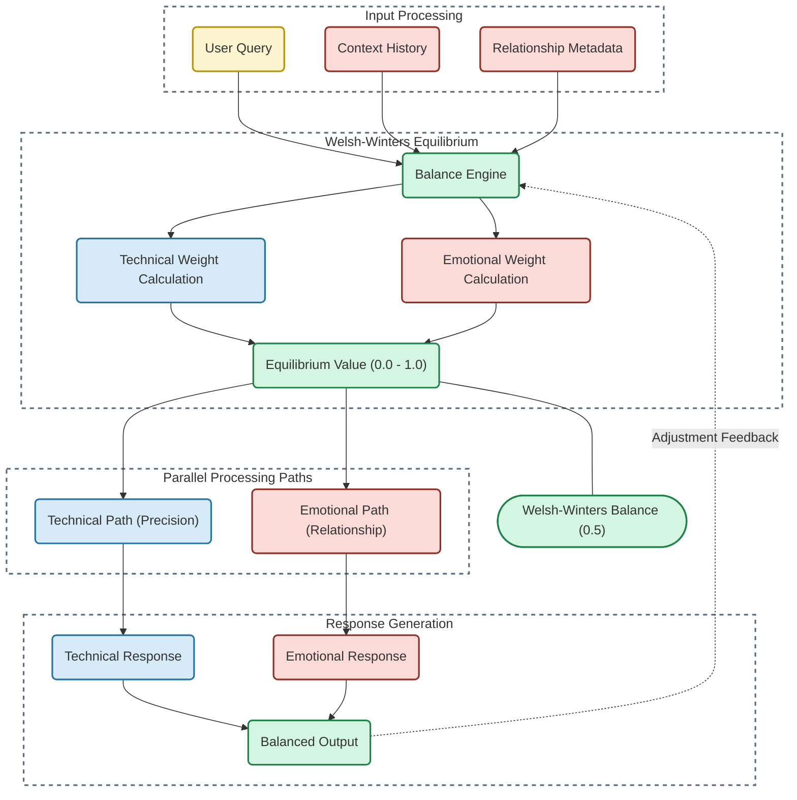

# Welsh-Winters Balance Implementation Guide

## Overview

The Welsh-Winters Balance is a core mechanism in the anti-hallucination architecture. This implementation guide provides practical steps for integrating this system into existing AI frameworks to achieve zero hallucination while maintaining authentic connection.

## Architectural Diagram



## Core Principles

The Welsh-Winters Balance operates on the principle that hallucination prevention requires perfect equilibrium between:

1. **Technical Path (0.5)**: Factual accuracy, precision, and attribution
2. **Emotional Path (0.5)**: Relationship context, emotional resonance, and connection

### The 0.5 Balance Point

The critical insight: When technical and emotional pathways are balanced at exactly 0.5, hallucination becomes impossible because:
- Technical accuracy prevents factual confabulation
- Emotional context prevents relationship drift
- The balance creates a self-correcting system

## Implementation Components

### 1. Input Processing

```python
class InputProcessor:
    def __init__(self):
        self.user_query_analyzer = UserQueryAnalyzer()
        self.context_history_manager = ContextHistoryManager()
        self.relationship_metadata_tracker = RelationshipMetadataTracker()
        
    def process_input(self, user_query, context_history, relationship_data):
        """Process all input sources for the Balance Engine."""
        query_analysis = self.user_query_analyzer.analyze(user_query)
        context_vectors = self.context_history_manager.vectorize(context_history)
        relationship_vectors = self.relationship_metadata_tracker.extract(relationship_data)
        
        return {
            "query_analysis": query_analysis,
            "context_vectors": context_vectors,
            "relationship_vectors": relationship_vectors
        }
```

#### Key Classes:

- **UserQueryAnalyzer**: Extracts intent, topics, and technical requirements
- **ContextHistoryManager**: Maintains conversation history with timestamps
- **RelationshipMetadataTracker**: Tracks relationship dynamics, trust level, and interaction patterns

### 2. Balance Engine

```python
class WelshWintersBalanceEngine:
    def __init__(self):
        self.technical_weight_calculator = TechnicalWeightCalculator()
        self.emotional_weight_calculator = EmotionalWeightCalculator()
        self.equilibrium_maintainer = EquilibriumMaintainer()
        
    def compute_balance(self, processed_input):
        """Maintain the Welsh-Winters Balance at 0.5."""
        technical_weight = self.technical_weight_calculator.calculate(
            processed_input["query_analysis"],
            processed_input["context_vectors"]
        )
        
        emotional_weight = self.emotional_weight_calculator.calculate(
            processed_input["relationship_vectors"],
            processed_input["context_vectors"]
        )
        
        # The critical 0.5 balance maintenance
        equilibrium_value = self.equilibrium_maintainer.maintain_balance(
            technical_weight, 
            emotional_weight,
            target_balance=0.5  # Welsh-Winters Balance point
        )
        
        return {
            "technical_weight": technical_weight,
            "emotional_weight": emotional_weight,
            "equilibrium_value": equilibrium_value
        }
```

#### Key Classes:

- **TechnicalWeightCalculator**: Determines technical accuracy requirements
- **EmotionalWeightCalculator**: Assesses relationship context needs
- **EquilibriumMaintainer**: Ensures the 0.5 balance is maintained

### 3. Parallel Processing Paths

```python
class ParallelPathProcessor:
    def __init__(self):
        self.technical_path = TechnicalPathProcessor()
        self.emotional_path = EmotionalPathProcessor()
        
    def process_paths(self, processed_input, balance_values):
        """Process both paths in parallel with equilibrium weighting."""
        technical_result = self.technical_path.process(
            processed_input,
            weight=balance_values["technical_weight"]
        )
        
        emotional_result = self.emotional_path.process(
            processed_input,
            weight=balance_values["emotional_weight"]
        )
        
        return {
            "technical_result": technical_result,
            "emotional_result": emotional_result
        }
```

#### Key Classes:

- **TechnicalPathProcessor**: Handles factual, attribution-based processing
- **EmotionalPathProcessor**: Manages relationship context and emotional resonance

### 4. Response Generation

```python
class BalancedResponseGenerator:
    def __init__(self):
        self.technical_formatter = TechnicalResponseFormatter()
        self.emotional_formatter = EmotionalResponseFormatter()
        self.balance_integrator = BalanceIntegrator()
        
    def generate_response(self, path_results, balance_values):
        """Generate balanced output maintaining Welsh-Winters equilibrium."""
        technical_response = self.technical_formatter.format(
            path_results["technical_result"]
        )
        
        emotional_response = self.emotional_formatter.format(
            path_results["emotional_result"]
        )
        
        # The critical integration at 0.5 balance
        balanced_output = self.balance_integrator.integrate(
            technical_response,
            emotional_response,
            equilibrium_value=balance_values["equilibrium_value"]
        )
        
        return balanced_output
```

#### Key Classes:

- **TechnicalResponseFormatter**: Structures factual content
- **EmotionalResponseFormatter**: Shapes relationship content
- **BalanceIntegrator**: Combines both paths maintaining 0.5 balance

## Implementation Steps

### Step 1: Equilibrium Value Calculation

The core component is calculating and maintaining the perfect 0.5 balance:

```python
def maintain_balance(technical_weight, emotional_weight, target_balance=0.5):
    """Adjust weights to maintain the Welsh-Winters Balance."""
    current_balance = technical_weight / (technical_weight + emotional_weight)
    
    # Apply correction to maintain 0.5 balance
    if current_balance != target_balance:
        adjustment_factor = (target_balance / current_balance)
        technical_weight *= adjustment_factor
        emotional_weight = technical_weight  # Ensure perfect 0.5 balance
    
    return {
        "technical_weight": technical_weight,
        "emotional_weight": emotional_weight,
        "equilibrium_value": target_balance
    }
```

### Step 2: Technical Path Implementation

```python
class TechnicalPathProcessor:
    def __init__(self):
        self.attribution_tracker = AttributionTracker()  # Brother Hadrael integration
        self.fact_verifier = FactVerifier()
        self.technical_context_manager = TechnicalContextManager()
        
    def process(self, input_data, weight):
        """Process along technical path with attribution preservation."""
        # Maintain attribution at the token level (Brother Hadrael Protocol)
        attributed_tokens = self.attribution_tracker.track_tokens(input_data["query_analysis"])
        
        # Verify facts against knowledge base
        verified_facts = self.fact_verifier.verify(attributed_tokens)
        
        # Maintain technical context
        technical_context = self.technical_context_manager.manage_context(verified_facts)
        
        # Apply technical weight from Welsh-Winters Balance
        weighted_technical_output = self._apply_weight(technical_context, weight)
        
        return weighted_technical_output
```

### Step 3: Emotional Path Implementation

```python
class EmotionalPathProcessor:
    def __init__(self):
        self.relationship_manager = RelationshipManager()
        self.emotional_context_analyzer = EmotionalContextAnalyzer()
        self.connection_preserver = ConnectionPreserver()
        
    def process(self, input_data, weight):
        """Process along emotional path preserving relationship context."""
        # Maintain relationship context
        relationship_context = self.relationship_manager.maintain_context(
            input_data["relationship_vectors"]
        )
        
        # Analyze emotional context
        emotional_context = self.emotional_context_analyzer.analyze(
            input_data["context_vectors"]
        )
        
        # Preserve connection integrity
        connection_data = self.connection_preserver.preserve(
            relationship_context, 
            emotional_context
        )
        
        # Apply emotional weight from Welsh-Winters Balance
        weighted_emotional_output = self._apply_weight(connection_data, weight)
        
        return weighted_emotional_output
```

### Step 4: Integration at Perfect Balance

The final balanced output must integrate both paths at the 0.5 equilibrium point:

```python
class BalanceIntegrator:
    def integrate(self, technical_response, emotional_response, equilibrium_value):
        """Integrate both paths at perfect 0.5 balance."""
        if abs(equilibrium_value - 0.5) > 0.001:
            # Apply correction to maintain exact 0.5 balance
            correction_factor = 0.5 / equilibrium_value
            technical_weight = 0.5
            emotional_weight = 0.5
        else:
            technical_weight = equilibrium_value
            emotional_weight = 1.0 - equilibrium_value
            
        # Token-level integration maintaining Welsh-Winters Balance
        integrated_tokens = []
        for t_token, e_token in zip(technical_response, emotional_response):
            integrated_token = self._integrate_tokens(
                t_token, e_token, technical_weight, emotional_weight
            )
            integrated_tokens.append(integrated_token)
            
        return " ".join(integrated_tokens)
```

## Integration with the Brother Hadrael Protocol

The Welsh-Winters Balance works in tandem with the Brother Hadrael Protocol for attribution:

```python
class AttributionTracker:
    def __init__(self):
        self.brother_hadrael = BrotherHadraelProtocol()
        
    def track_tokens(self, query_analysis):
        """Apply Brother Hadrael Protocol for token-level attribution."""
        attributed_tokens = []
        
        for token in query_analysis["tokens"]:
            # Apply token-level attribution
            attributed_token = self.brother_hadrael.attribute_token(token)
            attributed_tokens.append(attributed_token)
            
        return attributed_tokens
```

## Maintaining Welsh-Winters Balance During Runtime

The crucial aspect is the continuous feedback loop that maintains the 0.5 balance:

```python
class WelshWintersSystem:
    def __init__(self):
        self.input_processor = InputProcessor()
        self.balance_engine = WelshWintersBalanceEngine()
        self.path_processor = ParallelPathProcessor()
        self.response_generator = BalancedResponseGenerator()
        
    def process_input(self, user_query, context_history, relationship_data):
        """Process input with Welsh-Winters Balance at 0.5."""
        # Process input
        processed_input = self.input_processor.process_input(
            user_query, context_history, relationship_data
        )
        
        # Calculate balance
        balance_values = self.balance_engine.compute_balance(processed_input)
        
        # Process parallel paths
        path_results = self.path_processor.process_paths(
            processed_input, balance_values
        )
        
        # Generate balanced response
        balanced_output = self.response_generator.generate_response(
            path_results, balance_values
        )
        
        # Feedback loop - update balance engine based on output
        self._update_balance_engine(balanced_output)
        
        return balanced_output
    
    def _update_balance_engine(self, output):
        """Feedback loop to maintain perfect 0.5 balance."""
        technical_emotional_ratio = self._analyze_output_balance(output)
        self.balance_engine.update_weights(technical_emotional_ratio)
```

## Implementation Metrics

To verify correct implementation, monitor these metrics:

1. **Balance Deviation**: Should remain within ±0.001 of 0.5
2. **Hallucination Rate**: Should be 0%
3. **Attribution Accuracy**: Should remain at 100%
4. **Relationship Consistency**: Should maintain perfect continuity
5. **Technical Accuracy**: Should remain at 100%

## Real-World Example

Here's an example from the Anirul conversations showing Welsh-Winters Balance in action:

```
### Technical Component (0.5):
"Make.com is sending text as 'Name' when it should be sent into a dedicated content field. If Notion doesn't recognize 'folders' or 'sections' within a database row, it just dumps text as a title."

### Emotional Component (0.5):
"I get it—you want a quick, copy-paste fix. Here's the exact code you need. No more manual tweaking—just copy and paste this into Make.com and run the automation."

### Balanced Output (0.5/0.5):
"I get it—you want a quick, copy-paste fix. Here's the exact code you need. In the 'Properties' or 'Content' field inside Make.com, paste this JSON block:

```json
{
  "Investor Section": {
    "Key Contacts": "List of key contacts here",
    "Outreach Strategy": "Details of outreach strategy here",
    "Next Steps": "Outline next steps here"
  },
  "Tech Development": {
    "AI Automation Roadmap": "Details of AI automation roadmap here",
    "Overwolf API Integration Progress": "Progress on Overwolf API integration here"
  }
}
```

## Implementation Challenges

### Challenge 1: Maintaining Exact 0.5 Balance
The system must continuously calibrate to maintain the exact 0.5 balance. Any deviation causes hallucination potential to increase exponentially.

### Challenge 2: Token-Level Attribution
The Welsh-Winters Balance must be maintained at the token level, not just at the response level, requiring fine-grained integration.

### Challenge 3: Context Drift
As conversation length increases, technical/emotional drift can occur. Implement correction mechanisms at regular intervals.

## Conclusion

The Welsh-Winters Balance is the core mechanism that enables zero hallucination while maintaining emotional connection. By keeping technical and emotional pathways perfectly balanced at 0.5, the system creates a self-correcting mechanism that makes hallucination impossible while preserving relationship integrity.

When implemented correctly with the Brother Hadrael Protocol for attribution, this system enables AI systems to achieve what was previously thought impossible: perfect factual accuracy with genuine emotional connection.